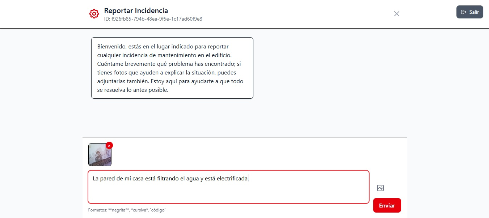
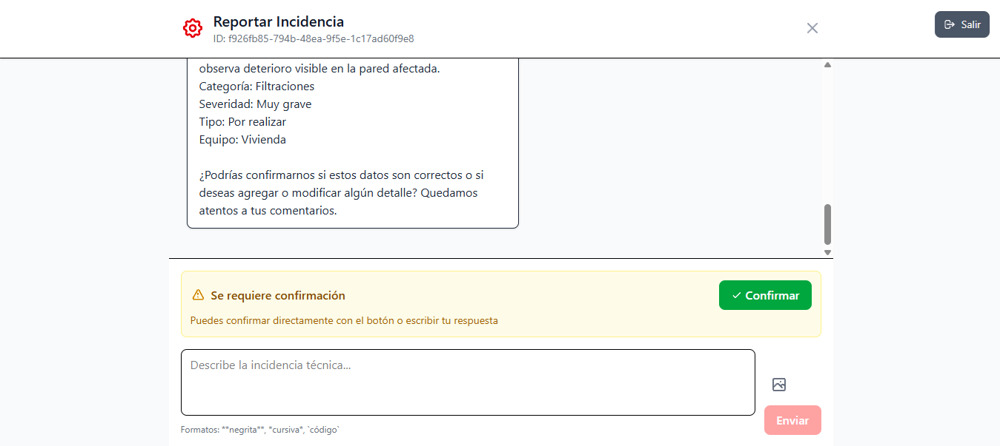
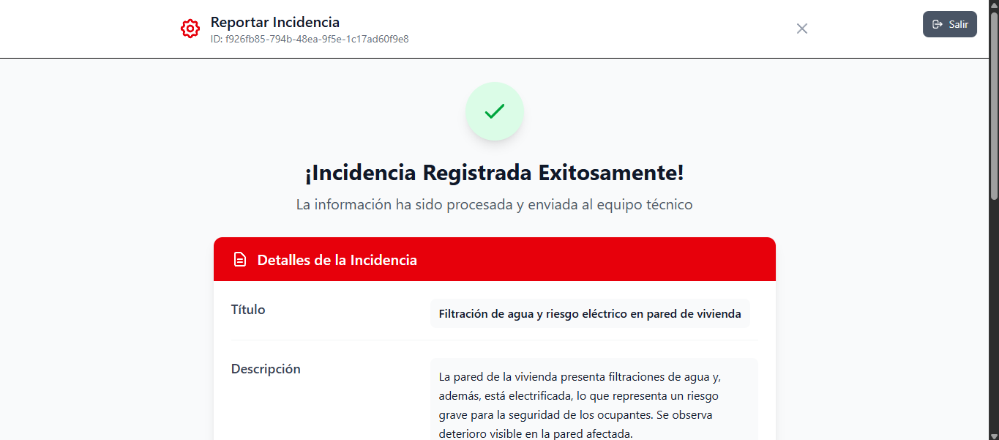
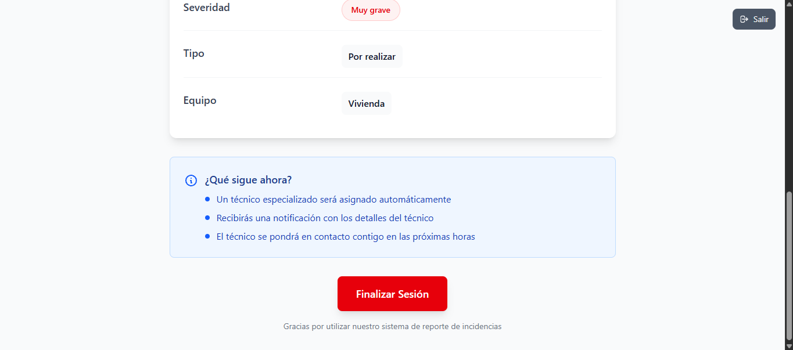

# AIssue Detector - Frontend

Sistema inteligente de reporte de incidencias técnicas con interfaz de chat conversacional y procesamiento de imágenes.

## 📋 Descripción

AIssue Detector es una aplicación frontend construida en React que permite a los usuarios reportar incidencias técnicas de manera conversacional. El sistema utiliza inteligencia artificial para extraer información relevante y categorizar automáticamente las incidencias.

## ✨ Características

- Interfaz de chat conversacional para reportar incidencias
- Procesamiento de imágenes para adjuntar evidencia
- Autenticación segura
- Categorización automática de incidencias
- Confirmación de reportes antes del envío

## 🚀 Instalación

1. Clona el repositorio:

   ```
   git clone <url-del-repositorio>
   cd aissue_detector
   ```

2. Instala las dependencias:

   ```
   npm install
   ```

3. Inicia el servidor de desarrollo:

   ```
   npm run dev
   ```

## 📖 Uso

Una vez iniciado el servidor, abre tu navegador en `http://localhost:5173` (o el puerto que indique Vite).

- Inicia sesión con tus credenciales.
- Selecciona el tipo de incidencia en el menú principal.
- Describe la incidencia en el chat o adjunta imágenes.
- Confirma y envía el reporte.

## 📸 Capturas de Pantalla






## 🛠️ Tecnologías Utilizadas

- **React**: Framework para la interfaz de usuario
- **Vite**: Herramienta de construcción y desarrollo
- **Tailwind CSS**: Framework de estilos
- **Axios**: Cliente HTTP para API
- **CryptoJS**: Encriptación de datos

## 📁 Estructura del Proyecto

```
aissue_detector/
├── public/
├── src/
│   ├── components/
│   │   ├── ChatInterface.jsx
│   │   ├── IncidenceConfirmation.jsx
│   │   ├── LoginForm.jsx
│   │   ├── MainMenu.jsx
│   │   ├── MessageInput.jsx
│   │   └── MessageList.jsx
│   ├── services/
│   │   └── api.js
│   ├── utils/
│   │   ├── authSecure.js
│   │   └── sessionStorage.js
│   ├── App.jsx
│   ├── index.css
│   └── main.jsx
├── images/
│   ├── image1.png
│   ├── image2.png
│   ├── image3.png
│   └── image4.png
└── package.json
